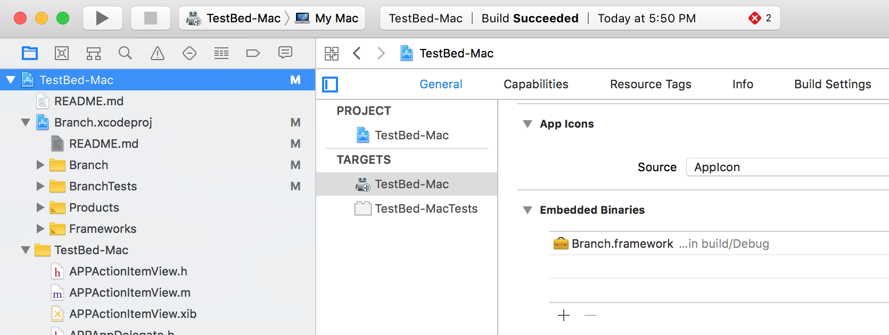

[](https://raw.githubusercontent.com/hyperium/hyper/master/LICENSE)

# Branch Metrics for Mac SDK

The Branch SDK for Mac brings universal deep linking to your app. The same `http://` web based Branch link open apps on
Mac, iOS, and Android so you can have one link that works on all your platforms.

Branch links are sophisticated links that adapt to a user's environment and can be configured with journeys and fallback options
so unexpected conditions are handled gracefully.

In addition you can track and analyze your app usage and the effectiveness of sharing virality, marketing campaigns, and cohorts
with atrribution, influencer, and content breakdowns of your links on the Branch dashboard.

## Contents

1. [Support and Example](#support-and-example)

2. [Deep Linking on the Mac](#deep-linking-on-the-mac)
   + [URI Scheme Considerations](#uri-scheme-considerations)
   + [How Branch Deep Linking for Mac Works](#how-branch-deep-linking-for-mac-works)

3. [Adding Branch to your App](#adding-branch-to-your-app)
   + [Get a Branch Key](#get-a-branch-key)
   + [Install the Framework](#install-the-framework)
   + [Update Your Info.plist](#add-an-app-scheme-to-your-info-plist)
   + [Add Some Code](#add-some-code)
   + [Rejoice](#rejoice)

4. [Branch Reference](#branch-reference)
   + [Turning on Logging](#turning-on-logging)
   + [Setting User Identities for Tracking Influencers](#setting-user-identities)
   + [Logging a User Out](#logout)
   + [Tracking user actions and events](#tracking-user-actions-and-events)
   + [Enable and Disable User Tracking](#enable-or-disable-user-tracking)

5. [Branch Universal Objects](#branch-universal-objects)
   + [Instantiate a Branch Universal Object](#branch-universal-object)
   + [Tracking user interactions with an object](#tracking-user-interactions-with-an-object)
   + [Configuring link properties](link-properties-parameters)
   + [Creating a short link referencing the object](#shortened-links)

## Support and Example

* If you need support or help integrating and using Branch, check our [Support Portal](http://support.branch.io).
* The TestBed-Mac project is a working example the uses Branch. [TestBed-Mac](https://github.com/BranchMetrics/Branch-SDK-Mac/tree/master/Examples/TestBed-Mac).


## Deep Linking on the Mac

The most familiar links look like `http://example.com` which are `http` links that open web pages. These are great for web
pages but don't open Mac apps. Instead, Mac apps open with URI schemes, the first part of a URI.

The parts of a URI are:

`<scheme>://<host>/<path>?<query>`

Common schemes are `mailto:`, `tel:`, `fax:` which do as you may expect.

You'll need to choose a unique URI scheme for your Mac app.

### URI Scheme Considerations

You need to choose an URI scheme that is not already in common use and is likely unique on a Mac. For instance, `web://` is
probably a bad choice. Many people choose the reverse domain name for their app or use their bundle identifier,
like `io.branch.cool-app://`.

Don't use an app scheme starting with `fb`, `db`, `twitterkit-`, `pin`, or `com.googleusercontent.apps`. These schemes
are ignored by Branch since they are commonly used by other app kits for oauth and other uses.

### How Branch Deep Linking for Mac Works

A Branch link is an web URL that looks like `https://your-app.app.link/bOsE0bbUtO`. When this link is clicked on a Mac it
opens a Branch web page that quickly determines if the Mac app can be opened on the user's computer, and if so, Branch
opens the app with a Mac URI scheme like `your-app-scheme://open?link_click_id=348527481794276288`.

(If the user doesn't have the app installed Branch can redirect the user to a fallback URL, like an app download page or some
other configurable place).

## Adding Branch to Your App

### Get a Branch Key

You can sign up for your own app id at [https://dashboard.branch.io](https://dashboard.branch.io).

You'll need your app scheme to configure your app in the Branch dashboard.

### Install the Framework

Add the Branch.framework as an embedded binary in your app.

You can drag and drop the framework into your app to install it.

In Xcode, click on  your project in the Project Navigator,  select your app in the Targets area, select the 'General' tab up top, and
scroll down to the 'Embedded Binaries' section. You can drag the Branch.framework bundle from the `Frameworks/macOS` project directory into this area.



### Add Your App Scheme to Your Info.plist

Add your app scheme to your Info.plist file so macOS knows what schemes your app can handle. This example shows
 `testbed-mac` as the app scheme. Add just the scheme and not the `://` part.


Here's a snippet of xml you can copy into your Info.plist. Right click on your Info.plist and open it as source code. You can paste
this snippet before the final `</dict>` tag. Remember to change `YOUR-APP-SCHEME-HERE` to the app scheme for your app.

```xml
	<key>CFBundleURLTypes</key>
	<array>
		<dict>
			<key>CFBundleTypeRole</key>
			<string>Editor</string>
			<key>CFBundleURLSchemes</key>
			<array>
				<string>YOUR-APP-SCHEME-HERE</string>
			</array>
		</dict>
	</array>
```

##### _Caution: Your app's URI scheme must be the first scheme defined (item 0) in the list._

The Branch SDK will use the first URI Scheme from your list that does not start with `fb`, `db`, `twitterkit-`, `pin`, or
`com.googleusercontent.apps`. These schemes are ignored by Branch since they are commonly used by other app kits for
oauth and other uses.

### Add Some Code

Start Branch when your app first starts up.  In your app delegate, start Branch in your  `applicationWillFinishLaunching:`
method:

```objc
#import <Branch/Branch.h>

// In your app delegate class file add this method to start the Branch SDK:
- (void)applicationWillFinishLaunching:(NSNotification *)aNotification {

    // Register for Branch URL notifications:
    [[NSNotificationCenter defaultCenter]
        addObserver:self
        selector:@selector(branchOpenedURLNotification:)
        name:BranchDidOpenURLWithSessionNotification
        object:nil];

    // Create a Branch configuration object with your key:
    BranchConfiguration*configuration =
        [[BranchConfiguration alloc] initWithKey:@"key_live_YOURBRANCHKEY"];

    // Start Branch:
    [[Branch sharedInstance] startWithConfiguration:configuration];
}
```

Next, add a notification handler so your app can handle the deep links:

```objc
- (void) branchOpenedURLNotification:(NSNotification*)notification {
    // Get the Branch session info:
    BranchSession*session = notification.userInfo[BranchSessionKey];

    // Do something with the link!
    // In this contrived example we'll load a view controller that plays the song that was in the link:
    SongViewController *viewController = [SongViewController loadController];
    viewController.songTitle = branchSession.linkContent.title;
    [viewController.window makeKeyAndOrderFront:self];
    [viewController playSong];
}
```

### Rejoice

Rejoice! You're just integrated Branch into your app.

## Branch Reference

### **Turning on Logging**

To help debugging your app, you can turn on Branch logging, which logs to the console. Remember to turn it off in your production app.

#### Property

`Branch.loggingEnabled`

See [**`loggingEnabled`**](Documentation/HTMLDocumentation/Classes/Branch.html#/c:objc(cs)Branch(py)loggingEnabled)

### **Setting User Identities**

Often, you might have your own user IDs, or want referral and event data to persist across platforms or uninstall/reinstall. It's
helpful if you know your users access your service from different devices. This where we introduce the concept of an
'user identity'.

#### Method

`setUserIdentity:completion:`

See [**`setUserIdentity:completion:`**](Documentation/HTMLDocumentation/Classes/Branch.html#/c:objc(cs)Branch(im)setUserIdentity:completion:)

### **Logout**

If you provide a logout function in your app, be sure to clear the user when the logout completes. This will ensure that all the stored parameters get cleared and all events are properly attributed to the right identity.

**Warning**: This call will clear attribution on the device.

#### Method

`logoutWithCompletion:`

See [**`logoutWithCompletion:`**](Documentation/HTMLDocumentation/Classes/Branch.html#/c:objc(cs)Branch(im)logoutWithCompletion:)

### Tracking User Actions and Events

Use the `BranchEvent` class to track special user actions or application specific events beyond app installs, opens, and sharing. You can track events such as when a user adds an item to an on-line shopping cart, or searches for a keyword, among others.

The `BranchEvent` interface provides an interface to add contents represented by BranchUniversalObject in order to associate app contents with events.

Analytics about your app's BranchEvents can be found on the Branch dashboard, and BranchEvents also provide tight integration with many third party analytics providers.

The `BranchEvent` class can be simple to use. For example:

###### Objective-C

```objc
[[Branch sharedInstance]
    logEvent:[BranchEvent standardEvent:BranchStandardEventAddToCart]];
```

###### Swift

```swift
Branch.sharedInstance.logEvent(BranchEvent.standardEvent(.addToCart))
```

For best results use the Branch standard event names defined in `BranchEvent.h`. But you can use your own custom event names too:

###### Objective-C

```objc
[Branch sharedInstance]
    logEvent:[BranchEvent customEventWithName:@"User_Scanned_Item"]];
```

###### Swift

```swift
Branch.sharedInstance.logEvent(BranchEvent.customEventWithName("User_Scanned_Item"))
```

Extra event specific data can be tracked with the event as well:

###### Objective-C

```objc
BranchEvent *event    = [BranchEvent standardEvent:BranchStandardEventPurchase];
event.transactionID   = @"tx-12344555";
event.currency        = BNCCurrencyUSD;
event.revenue         = [NSDecimalNumber decimalNumberWithString:@"12.70"];
event.shipping        = [NSDecimalNumber decimalNumberWithString:@"10.20"];
event.tax             = [NSDecimalNumber decimalNumberWithString:@"2.50"];
event.coupon          = @"coupon_code";
event.affiliation     = @"store_affiliation";
event.eventDescription= @"Shopper made a purchase.";
event.searchQuery     = @"Fashion Scarf";
event.contentItems    = @[ branchUniversalObject ];
event.customData      = (NSMutableDictionary*) @{
    @"Item_Color": @"Red",
    @"Item_Size":  @"Large"
};
[event logEvent];
```

###### Swift

```
let event = BranchEvent.standardEvent(.purchase)
event.transactionID    = "tx-12344555"
event.currency         = .USD
event.revenue          = 12.70
event.shipping         = 10.20
event.tax              = 2.50
event.coupon           = "coupon_code"
event.affiliation      = "store_affiliation"
event.eventDescription = "Shopper made a purchase."
event.searchQuery      = "Fashion Scarf"
event.contentItems     = [ branchUniversalObject ]
event.customData       = [
    "Item_Color": "Red",
    "Item_Size":  "Large"
]
event.logEvent()
```


### Enable or Disable User Tracking

In order to comply with privacy requirements, you can disable tracking at the SDK level. Simply call:

```objc
[Branch sharedInstance].trackingDisabled = YES;
```

```swift
Branch.sharedInstance().trackingDisabled = true
```

This will prevent any Branch network requests from being sent, except when deep linking. If someone clicks a Branch link, but does not want to be tracked, we will return the deep linking data back to the app but without capturing any tracking information.

In do-not-track mode, you will still be able to create & share links. The links will not have identifiable information and will be long format links. Event tracking won’t pass data back to the server if a user has expressed to not be tracked. You can change this behavior at any time by calling the above function. The trackingDisabled state is saved and persisted across app runs.

## Branch Universal Object

Use a BranchUniversalObject to describe content in your app for deep links, content analytics and indexing.

The properties object describes your content in a standard way so that it can be deep linked, shared, or indexed on spotlight for instance. You can set all the properties associated with the object and then call action methods on it to create a link or index the content on Spotlight.

### Branch Universal Object best practices

Here are a set of best practices to ensure that your analytics are correct, and your content is ranking on Spotlight effectively.

1. Set the `canonicalIdentifier` to a unique, de-duped value across instances of the app
2. Ensure that the `title`, `contentDescription` and `imageUrl` properly represent the object
3. Initialize the Branch Universal Object and call `userCompletedAction` with the `BNCRegisterViewEvent` **on page load**
4. Call `showShareSheet` and `createShortLink` later in the life cycle, when the user takes an action that needs a link
5. Call the additional object events (purchase, share completed, etc) when the corresponding user action is taken
6. Set the `contentIndexMode` to `ContentIndexModePublic` or `ContentIndexModePrivate`. If BranchUniversalObject is set to `ContentIndexModePublic`, then content would indexed using `NSUserActivity`, or else content would be index using `CSSearchableIndex` on Spotlight.

Note: Content indexed using `CSSearchableItem` could be removed from Spotlight but cannot be removed if indexed using `NSUserActivity`.

Practices to _avoid_:
1. Don't set the same `title`, `contentDescription` and `imageUrl` across all objects.
2. Don't wait to initialize the object and register views until the user goes to share.
3. Don't wait to initialize the object until you conveniently need a link.
4. Don't create many objects at once and register views in a `for` loop.

### Branch Universal Object

#### Methods and Properties

###### Objective-C

```objc
#import "BranchUniversalObject.h"
```

```objc
BranchUniversalObject *branchUniversalObject = [[BranchUniversalObject alloc] initWithCanonicalIdentifier:@"item/12345"];
branchUniversalObject.title = @"My Content Title";
branchUniversalObject.contentDescription = @"My Content Description";
branchUniversalObject.imageUrl = @"https://example.com/mycontent-12345.png";
branchUniversalObject.contentMetadata.contentSchema = BranchContentSchemaCommerceProduct;
branchUniversalObject.contentMetadata.customMetadata[@"property1"] = @"blue";
branchUniversalObject.contentMetadata.customMetadata[@"property2"] = @"red";
```

###### Swift

```swift
let branchUniversalObject: BranchUniversalObject = BranchUniversalObject(canonicalIdentifier: "item/12345")
branchUniversalObject.title = "My Content Title"
branchUniversalObject.contentDescription = "My Content Description"
branchUniversalObject.imageUrl = "https://example.com/mycontent-12345.png"
branchUniversalObject.contentMetadata.contentSchema = .product;
branchUniversalObject.contentMetadata.customMetadata["property1"] = "blue"
branchUniversalObject.contentMetadata.customMetadata["property2"] = "red"
```

#### Properties

**canonicalIdentifier**: This is the unique identifier for content that will help Branch de-dupe across many instances of the same thing. If you have a website with pathing, feel free to use that. Or if you have database identifiers for entities, use those.

**title**: This is the name for the content and will automatically be used for the OG tags. It will insert `$og_title` into the data dictionary of any link created.

**contentDescription**: This is the description for the content and will automatically be used for the OG tags. It will insert `$og_description` into the data dictionary of any link created.

**imageUrl**: This is the image URL for the content and will automatically be used for the OG tags. It will insert `$og_image_url` into the data dictionary of any link created.

**keywords**: Key words that describe the object. These are used for Spotlight search and web scraping so that users can find your content.

**locallyIndex**: If set to true, Branch will index this content on Spotlight on the user's phone.

**publiclyIndex**: If set to true, Branch will index this content on Google, Branch, etc.

**expirationDate**: The date when the content will not longer be available or valid. Currently, this is only used for Spotlight indexing but will be used by Branch in the future.

**contentMetadata**: Details that further describe your content. Set the properties of this sub-object depending on the type of content that is relevant to your content:

#### BranchUniversalObject.contentMetadata

The `BranchUniversalObject.contentMetadata` properties further describe  your content. These properties are trackable in the Branch dashboard and will be automatically exported to your connected third-party app intelligence partners like Adjust or Mixpanel.

Set the properties of this sub-object depending on the type of content that is relevant to your content. The `BranchUniversalObject.contentMetadata.contentSchema` property describes the type of object content. Set other properties as is relevant to the type.

**contentMetadata.contentSchema**: Set this property to a `BranchContentSchema` enum that best describes the content type. It accepts values like `BranchContentSchemaCommerceProduct` and `BranchContentSchemaMediaImage`.

**contentMetadata.customMetadata**: This dictionary contains any extra parameters you'd like to associate with the Branch Universal Object. These will be made available to you after the user clicks the link and opens up the app.

**contentMetadata.price**: The price of the item to be used in conjunction with the commerce related events below.

**contentMetadata.currency**: The currency representing the price in [ISO 4217 currency code](http://en.wikipedia.org/wiki/ISO_4217). The default is USD.

**contentMetadata.quantity**: The quantity.

**contentMetadata.sku**: The vendor SKU.

**contentMetadata.productName**: Product name.

**contentMetadata.productBrand**: Product brand.

**contentMetadata.productCategory**: The `BNCProductCategory` value, such as `BNCProductCategoryAnimalSupplies` or `BNCProductCategoryFurniture`.

**contentMetadata.productVariant**: The product variant.

**contentMetadata.condition**: The `BranchCondition` value, such as `BranchConditionNew` or `BranchConditionRefurbished`.

**ratingAverage, ratingCount, ratingMax**: The rating for your content.

**addressStreet, addressCity, addressRegion, addressCountry, addressPostalCode**: The address of your content.

**latitude, longitude**: The longitude and latitude of your content.

**imageCaptions**: Image captions for the content's images.

### Tracking User Interactions With An Object

We've added a series of custom events that you'll want to start tracking for rich analytics and targeting. Here's a list below with a sample snippet that calls the register view event.

| Key | Value
| --- | ---
| BranchStandardEventViewItem | User viewed the object
| BranchStandardEventAddToWishlist | User added the object to their wishlist
| BranchStandardEventAddToCart | User added object to cart
| BranchStandardEventInitiatePurchase | User started to check out
| BranchStandardEventPurchase | User purchased the item
| BranchStandardEventShare | User completed a share

#### Methods

###### Objective-C

```objc
[branchUniversalObject userCompletedAction:BranchStandardEventViewItem];
```

###### Swift

```swift
branchUniversalObject.userCompletedAction(BranchStandardEventViewItem)
```

#### Parameters

None

#### Returns

None

### Shortened Links

Once you've created your `Branch Universal Object`, which is the reference to the content you're interested in, you can then get a link back to it with the mechanisms described below.

#### Encoding Note

One quick note about encoding. Since `NSJSONSerialization` supports a limited set of classes, we do some custom encoding to allow additional types. Current supported types include `NSDictionary`, `NSArray`, `NSURL`, `NSString`, `NSNumber`, `NSNull`, and `NSDate` (encoded as an ISO8601 string with timezone). If a parameter is of an unknown type, it will be ignored.

#### Methods

###### Objective-C

```objc
#import "BranchLinkProperties.h"
```

```objc
BranchLinkProperties *linkProperties = [[BranchLinkProperties alloc] init];
linkProperties.feature = @"sharing";
linkProperties.channel = @"facebook";
[linkProperties addControlParam:@"$desktop_url" withValue:@"http://example.com/home"];
[linkProperties addControlParam:@"$ios_url" withValue:@"http://example.com/ios"];
```

```objc
[branchUniversalObject getShortUrlWithLinkProperties:linkProperties andCallback:^(NSString *url, NSError *error) {
    if (!error) {
        NSLog(@"success getting url! %@", url);
    }
}];
```

###### Swift

```swift
let linkProperties: BranchLinkProperties = BranchLinkProperties()
linkProperties.feature = "sharing"
linkProperties.channel = "facebook"
linkProperties.addControlParam("$desktop_url", withValue: "http://example.com/home")
linkProperties.addControlParam("$ios_url", withValue: "http://example.com/ios")
```

```swift
branchUniversalObject.getShortUrl(with: linkProperties) { (url, error) in
    if error == nil {
        NSLog("got my Branch link to share: %@", url)
    }
}
```

#### Link Properties Parameters

**channel**: The channel for the link. Examples could be Facebook, Twitter, SMS, etc., depending on where it will be shared.

**feature**: The feature the generated link will be associated with. Eg. `sharing`.

**controlParams**: A dictionary to use while building up the Branch link. Here is where you specify custom behavior controls as described in the table below.

You can do custom redirection by inserting the following _optional keys in the dictionary_:

| Key | Value
| --- | ---
| "$fallback_url" | Where to send the user for all platforms when app is not installed. Note that Branch will forward all robots to this URL, overriding any OG tags entered in the link.
| "$desktop_url" | Where to send the user on a desktop or laptop. By default it is the Branch-hosted text-me service.
| "$android_url" | The replacement URL for the Play Store to send the user if they don't have the app. _Only necessary if you want a mobile web splash_.
| "$ios_url" | The replacement URL for the App Store to send the user if they don't have the app. _Only necessary if you want a mobile web splash_.
| "$ipad_url" | Same as above, but for iPad Store.
| "$fire_url" | Same as above, but for Amazon Fire Store.
| "$blackberry_url" | Same as above, but for Blackberry Store.
| "$windows_phone_url" | Same as above, but for Windows Store.
| "$after_click_url" | When a user returns to the browser after going to the app, take them to this URL. _iOS only; Android coming soon_.

You have the ability to control the direct deep linking of each link by inserting the following _optional keys in the dictionary_:

| Key | Value
| --- | ---
| "$deeplink_path" | The value of the deep link path that you'd like us to append to your URI. For example, you could specify "$deeplink_path": "radio/station/456" and we'll open the app with the URI "yourapp://radio/station/456?link_click_id=branch-identifier". This is primarily for supporting legacy deep linking infrastructure.
| "$always_deeplink" | true or false. (default is not to deep link first) This key can be specified to have our linking service force try to open the app, even if we're not sure the user has the app installed. If the app is not installed, we fall back to the respective app store or $platform_url key. By default, we only open the app if we've seen a user initiate a session in your app from a Branch link (has been cookied and deep linked by Branch).

**alias**: The alias for a link. Eg. `myapp.com/customalias`

**matchDuration**: The attribution window in seconds for clicks coming from this link.

**stage**: The stage used for the generated link, indicating what part of a funnel the user is in.

**tags**: An array of tag strings to be associated with the link.

#### Get Short Url Parameters

**linkProperties**: The link properties created above that describe the type of link you'd like

**callback**: The callback that is called with url on success, or an error if something went wrong. Note that we'll return a link 100% of the time. Either a short one if network was available or a long one if it was not.
